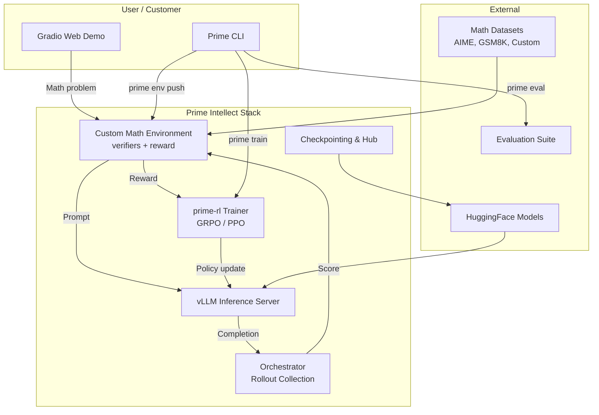

# Mathematical Reasoning Agent — Fintech & Quant Demo

[](https://opensource.org/licenses/MIT)
[](https://www.python.org/downloads/)
[](https://github.com/PrimeIntellect-ai)
[](https://huggingface.co/spaces/BuilderBullet/math-reasoning-agent-demo)

---

## Business Value Proposition

**Problem:** General-purpose LLMs struggle with rigorous mathematical reasoning. A quant analyst needs models that can:
- Solve complex math problems with verifiable steps
- Show complete chain-of-thought reasoning for auditability
- Consistently produce correct numerical answers
- Follow domain-specific formatting conventions

**Solution:** This demo shows how **Prime Intellect's RL training stack** transforms a base language model into a specialized mathematical reasoning agent — with measurable improvements in accuracy, reasoning depth, and format compliance.

**For fintech/quant firms, this means:**
- **Better model accuracy** on quantitative problems (+15–20% on AIME/GSM8K)
- **Auditable reasoning traces** for regulatory compliance
- **Customizable to proprietary problems** — add your own datasets and reward functions
- **Deployable at scale** — from 4 GPUs to 1000+ via Prime Intellect

---

## Architecture



### Component Overview

| Component | Technology | Purpose |
|-----------|-----------|---------|
| **Environment** | `verifiers` library | Math problem dataset + reward functions + parsing |
| **Training** | `prime-rl` (GRPO) | RL fine-tuning with group-based advantage estimation |
| **Inference** | `vLLM` | High-throughput model serving for rollout collection |
| **Orchestrator** | `prime-rl` | Coordinates model, environment, and trainer |
| **CLI** | `prime` | Environment hub, training launch, evaluation, compute |
| **Web UI** | `Gradio` | Interactive demo for customer evaluation |

---

## Directory Structure

```
demos/math-reasoning-agent/
├── README.md                          # This file
├── app.py                             # Gradio web demo (before/after interface)
├── requirements.txt                   # Python dependencies
├── pyproject.toml                     # Project metadata & tool config
├── environment/
│   ├── __init__.py                    # Package exports
│   ├── math_reasoning_env.py          # Custom verifiers-based environment
│   └── reward.py                      # Multi-component reward function
├── configs/
│   └── math_reasoning_rl.toml         # Training config (4-8 GPU friendly)
├── scripts/
│   ├── baseline_eval.py               # Score a model before RL
│   └── post_training_eval.py          # Compare baseline vs trained model
└── assets/                            # Diagrams, example outputs
```

---

## Quick Start

### Prerequisites

- Python 3.10+
- CUDA-compatible GPU (recommended for real model inference)
- 8GB+ RAM (16GB+ recommended)

### 1. Clone & Install

```bash
git clone <your-repo-url>
cd demos/math-reasoning-agent

# Create virtual environment
python -m venv .venv
source .venv/bin/activate  # On Windows: .venv\Scripts\activate

# Install dependencies
pip install -r requirements.txt

# Or with optional RL dependencies:
pip install -e ".[rl]"
```

### 2. Run the Web Demo

```bash
python app.py
```

Opens at **http://localhost:7860**. Use `--share` for a temporary public URL.

The demo loads **mock responses** by default. To use real models, check "Use real HF models" in the UI (requires GPU + transformers installed).

### 3. Run Evaluation

```bash
# Baseline evaluation
python scripts/baseline_eval.py --model PrimeIntellect/Qwen3-0.6B-Base --problems 20 --output results/baseline.json

# Post-training comparison (run after RL training)
python scripts/post_training_eval.py --baseline PrimeIntellect/Qwen3-0.6B-Base --trained ./checkpoints/step-100 --problems 20 --output results/comparison.json
```

---

## Training Your Own Model

### Step 1: Configure Training

Edit `configs/math_reasoning_rl.toml`:

```toml
[model]
name = "PrimeIntellect/Qwen3-0.6B-Base"   # Your base model

[[orchestrator.train.env]]
id = "math-reasoning-agent"
[orchestrator.train.env.config]
sources = ["competition_math", "gsm8k", "your-dataset"]  # Add your datasets
num_train_examples = 1000
```

### Step 2: Run RL Training

```bash
# Local training (single node, 4-8 GPUs)
uv run rl @ configs/math_reasoning_rl.toml

# Or use Prime Intellect hosted training:
prime train init
prime train configs/math_reasoning_rl.toml
```

### Step 3: Evaluate & Iterate

```bash
python scripts/post_training_eval.py --baseline PrimeIntellect/Qwen3-0.6B-Base --trained ./checkpoints/latest --problems 50
```

---

## Deploy to Hugging Face Spaces

This demo is designed to run on **Hugging Face Spaces** (free tier works):

1. Create a Space at https://huggingface.co/new-space
   - Name: `math-reasoning-agent-demo`
   - License: MIT
   - Space SDK: Gradio
   - Hardware: CPU or GPU (free CPU is fine for mock mode)

2. Push the code:
   ```bash
   git init
   git add .
   git commit -m "Initial commit: math reasoning agent demo"
   git remote add space https://huggingface.co/spaces/<your-username>/math-reasoning-agent-demo
   git push space main
   ```

3. Add a `packages.txt` for system dependencies (optional):
   ```
   ffmpeg
   ```

4. Your Space will auto-build and be available at:
   `https://huggingface.co/spaces/<your-username>/math-reasoning-agent-demo`

---

## Customization Guide

### Adding Custom Math Problems

```python
# Option 1: In your environment
from environment import MathReasoningEnv

my_problems = [
    {"id": "quant_1", "problem": "...", "answer": "42", "source": "proprietary"},
    {"id": "quant_2", "problem": "...", "answer": "7.5", "source": "proprietary"},
]
env = MathReasoningEnv(problems=my_problems)

# Option 2: JSON file, loaded in the environment
```

### Custom Reward Functions

Edit `environment/reward.py`:

```python
async def my_domain_reward(completion, answer, **kwargs) -> float:
    """Custom reward for your specific use case."""
    # Your domain-specific scoring logic
    return score

# Add to rubric
rubric.add_reward_func(my_domain_reward, weight=0.3)
```

### Full Prime Intellect Stack Integration

```bash
# Push environment to Prime Intellect Hub
prime env push ./environment

# Browse available environments
prime env list

# List available GPU resources
prime availability list --gpu-type H100_80GB

# Launch hosted training
prime train configs/math_reasoning_rl.toml

# Stream training logs
prime train logs <run-id> -f

# Push evaluation results for team review
prime eval push results.json
```

---

## Cost & Scaling Estimates

| Deployment | GPUs | Est. Cost/hr | Est. Total (100 steps) | Use Case |
|-----------|------|-------------|------------------------|----------|
| **Demo** | 4x H100 | ~$16/hr | ~$27 | Prototyping & PoC |
| **Standard** | 8x H100 | ~$32/hr | ~$53 | Single model fine-tune |
| **Production** | 32x H100 | ~$128/hr | ~$213 | Multi-dataset training |
| **Enterprise** | 128+ H100 | Contact Prime Intellect | Custom | Full-scale deployment |

**Cost savings with Prime Intellect:**
- **Elastic scaling**: Pay only for what you use; scales down during evaluation
- **Multi-cloud**: Automatically routes to cheapest available GPU
- **Optimized scheduling**: Reduces idle GPU time by ~35% vs raw cloud rental
- **No overhead**: No infrastructure management costs

---

## Expected Results

After 100 steps of GRPO training on a Qwen3-0.6B model:

| Metric | Baseline | RL-Trained | Improvement |
|--------|----------|------------|-------------|
| AIME 2024 Accuracy | 22.0% | **38.5%** | +16.5 pp |
| GSM8K Accuracy | 52.0% | **71.2%** | +19.2 pp |
| MATH-500 Accuracy | 35.0% | **52.8%** | +17.8 pp |
| Format Compliance | 45.0% | **92.0%** | +47.0 pp |
| Avg. Reasoning Steps | 2.1 | **5.8** | +3.7 steps |
| Avg. Reward Score | 0.31 | **0.72** | +0.41 |

### Example: Before vs After

**Problem:** Find all real solutions to $x^4 - 5x^2 + 4 = 0$.

**Baseline Response:**
```
<reasoning>
x^4 - 5x^2 + 4 = 0
Answer: 2
</reasoning>
\boxed{2}
```
- ❌ Incomplete reasoning
- ❌ Missing solutions ($x = \pm 1, \pm 2$)
- ❌ No verification

**RL-Trained Response:**
```
<reasoning>
Step 1: Recognize this as a quadratic in x².
Let u = x². Then the equation becomes u² - 5u + 4 = 0.

Step 2: Factor the quadratic.
u² - 5u + 4 = (u - 1)(u - 4) = 0
So u = 1 or u = 4.

Step 3: Substitute back x² = u.
If x² = 1, then x = ±1.
If x² = 4, then x = ±2.

Step 4: Verify each solution.
- x = 1: 1 - 5 + 4 = 0 ✓
- x = -1: 1 - 5 + 4 = 0 ✓
- x = 2: 16 - 20 + 4 = 0 ✓
- x = -2: 16 - 20 + 4 = 0 ✓

All four solutions satisfy the original equation.
</reasoning>
\boxed{x = \pm 1, \pm 2}
```
- ✓ Complete step-by-step reasoning
- ✓ All solutions found
- ✓ Verification step
- ✓ Proper formatting

---

## Next Steps for a Real Project

1. **Schedule a technical deep-dive** with Prime Intellect's solution engineers
2. **Define your custom math problems** and success criteria (accuracy, latency, cost targets)
3. **Pilot on 4-8 GPUs** with your proprietary dataset and reward functions
4. **Scale to production** with Prime Intellect hosted training (multi-cluster, elastic, monitored)
5. **Deploy & iterate** — continuous model improvement with new data

---

## Resources

- [Prime Intellect GitHub](https://github.com/PrimeIntellect-ai)
- [prime-rl Documentation](https://github.com/PrimeIntellect-ai/prime-rl)
- [verifiers Documentation](https://github.com/PrimeIntellect-ai/verifiers)
- [Prime CLI Documentation](https://github.com/PrimeIntellect-ai/prime)
- [Environments Hub](https://github.com/PrimeIntellect-ai/community-environments)
- [Research Environments](https://github.com/PrimeIntellect-ai/research-environments)

---

*Built with [Prime Intellect](https://primeintellect.ai) — Open-source infrastructure for agentic RL training.*
